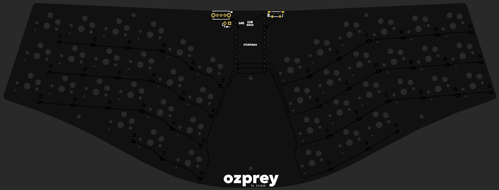
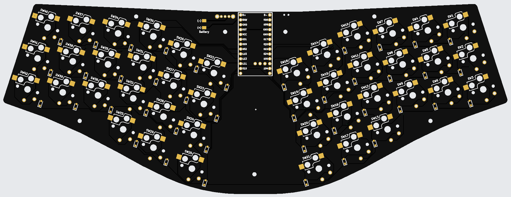

# Ozprey - A remix of [osprey-remix](https://github.com/kapee1/osprey-remix)

## Changes compared to the original Osprey

-   Remove cutout under MCU to allow more flexible PCB trace routing.
-   Remove battery holder cutout, replace onboard battery connector socket with battery connector pads.
    -   These changes were made since I want to use a large Li-Po battery placed under the PCB.
-   Simplify top edge, widen the split gap to accomodate changed switch footprint.
-   Replace power and reset switch footprint. Schematics for both can be found inside [img](./img) folder.
-   Adjust onboard M2 mounting holes' position.

These changes made the board incompatible with the original case & plate. You can get the [.STEP file](./ozprey_case/osprey_pcb.step) and design your own case & plate.

## Thanks

Huge thanks to [ebastler](https://github.com/ebastler), author of the [original project](https://github.com/ebastler/osprey) for the inspiration and design, and [kapee1](https://github.com/kapee1) for the nice!nano implementation with the [osprey-remix](https://github.com/kapee1/osprey-remix).

The keyboard switch footprint was from [daprice/keyswitches.pretty](https://github.com/daprice/keyswitches.pretty).

## Disclaimer

This is a **personal project** and not affiliated with the original authors. Due to the changes, the board is not compatible with the original case and plate.

The gerber file has been checked against JLCPCB's DFM checker and no critical error was found. All files are provided as-is, **without any warranty or support**. Use at your own risk.
