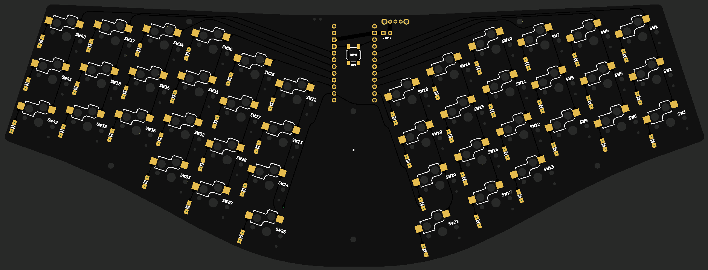
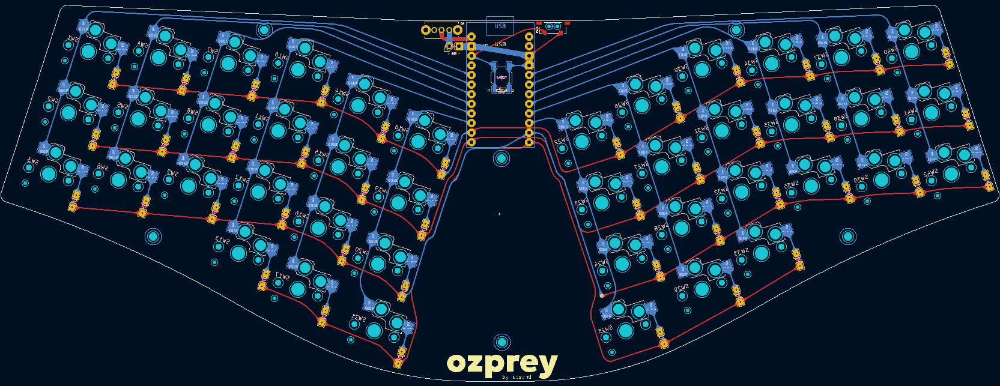

# Ozprey - A remix of [osprey-remix](https://github.com/kapee1/osprey-remix)

## Changes compared to the original Osprey

-   Support **both hotswap and soldered** Choc v1 switches. This led to complete rework of the trace routing.
-   Remove cutout under MCU to allow more flexible PCB trace routing.
-   Remove battery holder cutout, replace onboard JST connector with a battery connector pads.
    -   These changes were made since I want to use a large LiPo battery placed under the PCB.
-   simplify top edge, widen the split gap to accomodate changed switch footprint.
    -   This made the board incompatible with the original case and plate. I'm currently working on a new case and plate design.
-   Add SMD "Reset" push button (TL3342).
-   Adjust onboard M2 mounting holes' position.

## Thanks

Huge thanks to the [ebastler](https://github.com/ebastler), author of the [original project](https://github.com/ebastler/osprey) for the inspiration and design, and [kapee1](https://github.com/kapee1) for the nice!nano implementation with the [osprey-remix](https://github.com/kapee1/osprey-remix).

## Disclaimer

This is a **personal project** and not affiliated with the original authors. Due to the changes, the board is not compatible with the original case and plate.

The gerber file has been checked against JLCPCB's DFM checker and no critical error was found. All files are provided as-is, **without any warranty or support**. Use at your own risk.
